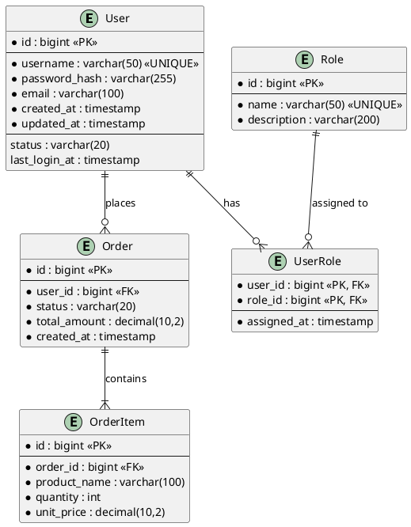

# Database Schema Design Rules

This document defines the database schema design methodology for JavaFX desktop applications. It covers entity-relationship (ER) modeling with PlantUML, schema design conventions, indexing strategy, migration planning (Flyway/Liquibase), and the handoff protocol to `javafx-developer`. It serves as the reference for `javafx-architect`'s Database Design dimension.

## 1. Overview

Most JavaFX desktop applications require local or remote data persistence. Common choices include:

| Database | When to Choose | ORM Pairing |
|----------|---------------|-------------|
| **SQLite** | Single-user desktop apps, embedded, zero-config, file-based | JDBC, MyBatis |
| **H2 (embedded)** | In-memory or file-based, faster than SQLite for testing | JPA/Hibernate, JDBC |
| **PostgreSQL** | Multi-user apps with remote server, complex queries, JSON support | JPA/Hibernate, MyBatis |
| **MySQL/MariaDB** | Multi-user apps with remote server, widely deployed | JPA/Hibernate, MyBatis |
| **None** | Apps that use file-based storage (JSON/XML) or remote API only | — |

The architect must make the database choice during System Design (Step 2) and then design the schema in the Database Design step.

## 2. ER Diagram Generation (PlantUML)

### 2.1 PlantUML ER Diagram Syntax

PlantUML does not have a native ER diagram type, but entity diagrams can be expressed using the `entity` keyword (IE notation) or class diagrams with relationship arrows. The recommended approach is **IE (Crow's Foot) notation** using entity blocks:



### 2.2 Notation Guide

| Symbol | Meaning |
|--------|---------|
| `*` (before field name) | NOT NULL constraint |
| `<<PK>>` | Primary Key |
| `<<FK>>` | Foreign Key |
| `<<UNIQUE>>` | Unique constraint |
| `<<INDEX>>` | Indexed (non-unique) |
| `\|\|` | Exactly one (mandatory) |
| `o{` | Zero or many (optional) |
| `\|\|{` | One or many (mandatory) |
| `\|\|o` | Zero or one (optional) |

### 2.3 Diagram File Location

ER diagrams are saved to: `architecture/uml/er-diagram.puml`

## 3. Schema Design Conventions

### 3.1 Naming Conventions

| Element | Convention | Example |
|---------|-----------|---------|
| Table name | snake_case, singular | `user`, `order_item`, `user_role` |
| Column name | snake_case | `created_at`, `password_hash`, `total_amount` |
| Primary key | `id` | `id` |
| Foreign key | `{referenced_table_singular}_id` | `user_id`, `order_id` |
| Junction table | `{table_a}_{table_b}` (alphabetical) | `user_role`, `order_product` |
| Index name | `idx_{table}_{columns}` | `idx_user_email`, `idx_order_user_id_status` |
| Unique index name | `uk_{table}_{columns}` | `uk_user_username`, `uk_user_email` |
| Boolean column | `is_` or `has_` prefix | `is_active`, `has_notification` |
| Timestamp column | `_at` suffix | `created_at`, `updated_at`, `deleted_at` |

### 3.2 Standard Audit Columns

Every table should include standard audit columns:

| Column | Type | Default | Description |
|--------|------|---------|-------------|
| `id` | `BIGINT` / `INTEGER` | Auto-increment / Generated | Primary key |
| `created_at` | `TIMESTAMP` | `CURRENT_TIMESTAMP` | Record creation time |
| `updated_at` | `TIMESTAMP` | `CURRENT_TIMESTAMP` (on update) | Last modification time |
| `deleted_at` | `TIMESTAMP` | NULL | Soft delete timestamp (nullable; if soft delete is used) |

### 3.3 Data Type Selection

| JavaFX/Java Type | SQL Type | Notes |
|------------------|----------|-------|
| `String` (short, ≤ 50) | `VARCHAR(50)` | Username, code, status |
| `String` (medium, ≤ 255) | `VARCHAR(255)` | Email, hash, title |
| `String` (long, variable) | `TEXT` / `CLOB` | Description, notes, content |
| `Long` / `long` | `BIGINT` | IDs, counters |
| `Integer` / `int` | `INTEGER` | Quantity, status code |
| `Boolean` / `boolean` | `BOOLEAN` / `SMALLINT` | Flags (SQLite uses INTEGER for boolean) |
| `BigDecimal` | `DECIMAL(p, s)` | Money (always DECIMAL, never FLOAT) |
| `LocalDateTime` | `TIMESTAMP` | Date-time without timezone |
| `LocalDate` | `DATE` | Date only |
| `byte[]` | `BLOB` | Binary data (file content, images) |

> **Money columns**: Always use `DECIMAL(precision, scale)` for monetary values. Never use `FLOAT` or `DOUBLE` — floating-point rounding errors cause accounting discrepancies. For JavaFX desktop apps, `DECIMAL(10, 2)` is sufficient for most currencies (10 total digits, 2 after decimal point).

### 3.4 Constraint Design

1. **Primary Key**: Every table must have a single-column auto-incrementing primary key (`id BIGINT PRIMARY KEY AUTOINCREMENT` for SQLite, `id BIGINT GENERATED ALWAYS AS IDENTITY PRIMARY KEY` for PostgreSQL)
2. **Foreign Key**: All foreign keys must have `ON DELETE` and `ON UPDATE` actions:
   - `ON DELETE RESTRICT`: Prevent deletion if referenced (default for critical relationships)
   - `ON DELETE CASCADE`: Delete dependent records (for parent-child like Order→OrderItem)
   - `ON DELETE SET NULL`: Set FK to NULL (for optional relationships)
3. **NOT NULL**: Apply `NOT NULL` to all required columns — do not rely on application-level validation alone
4. **UNIQUE**: Apply to business-unique columns (username, email, code) — enforce at database level
5. **CHECK**: Use CHECK constraints for enum-like values: `CHECK (status IN ('PENDING', 'ACTIVE', 'CLOSED'))`

### 3.5 Soft Delete Strategy

For desktop apps where data recovery is important:

```sql
-- Add deleted_at column
ALTER TABLE user ADD COLUMN deleted_at TIMESTAMP NULL;

-- All queries must filter: WHERE deleted_at IS NULL
-- Or create a view:
CREATE VIEW active_user AS
SELECT * FROM user WHERE deleted_at IS NULL;
```

> **Soft delete trade-off**: Soft delete preserves data but complicates queries (every query needs `WHERE deleted_at IS NULL`) and unique constraints (a soft-deleted username blocks re-registration). Consider using partial unique indexes: `CREATE UNIQUE INDEX uk_user_username ON user(username) WHERE deleted_at IS NULL` (PostgreSQL).

## 4. Indexing Strategy

### 4.1 When to Index

| Scenario | Index Recommendation |
|----------|---------------------|
| Column used in `WHERE` clause frequently | Create index |
| Column used in `JOIN ON` condition | Create index (FK columns should be indexed) |
| Column used in `ORDER BY` frequently | Create index |
| Column used in `GROUP BY` frequently | Create index |
| Column with low cardinality (≤ 10 distinct values) | Skip index (full scan may be faster) |
| Small table (< 100 rows) | Skip index (full scan is fast enough) |

### 4.2 Index Types

| Index Type | When to Use | SQL Example |
|-----------|-------------|-------------|
| Single-column | Simple equality/range lookups | `CREATE INDEX idx_user_email ON user(email)` |
| Composite | Multiple-column WHERE clauses | `CREATE INDEX idx_order_user_status ON order(user_id, status)` |
| Unique | Business uniqueness enforcement | `CREATE UNIQUE INDEX uk_user_username ON user(username)` |
| Covering | All queried columns in index (avoids table lookup) | PostgreSQL: `CREATE INDEX idx_covering ON order(user_id) INCLUDE (status, total_amount)` |

### 4.3 Foreign Key Indexing

**Every foreign key column must be indexed.** This is critical for join performance and is often overlooked:

```sql
-- Foreign keys don't automatically get indexes in most databases
CREATE INDEX idx_order_user_id ON order(user_id);
CREATE INDEX idx_order_item_order_id ON order_item(order_id);
CREATE INDEX idx_user_role_user_id ON user_role(user_id);
CREATE INDEX idx_user_role_role_id ON user_role(role_id);
```

### 4.4 Composite Index Column Order

For composite indexes, the column order matters. Follow these rules:

1. **Equality columns first**: Columns used with `=` go before columns used with range (`>`, `<`, `BETWEEN`)
2. **High selectivity first**: More selective columns (more distinct values) go first
3. **Sort columns last**: Columns used for `ORDER BY` go last

```sql
-- Good: user_id (equality, high selectivity) then status (equality, low selectivity) then created_at (range/sort)
CREATE INDEX idx_order_user_status_created ON order(user_id, status, created_at);
```

## 5. Migration Planning

### 5.1 Flyway (Recommended for JavaFX Desktop Apps)

Flyway is lightweight and integrates well with Spring Boot + JavaFX:

**Maven dependency**:
```xml
<dependency>
    <groupId>org.flywaydb</groupId>
    <artifactId>flyway-core</artifactId>
    <version>10.20.1</version>
</dependency>
```

**Migration file naming convention**:
```
src/main/resources/db/migration/
├── V1.0.0__create_user_table.sql
├── V1.0.1__create_role_table.sql
├── V1.0.2__create_user_role_table.sql
├── V1.0.3__create_order_table.sql
├── V1.1.0__add_soft_delete_to_user.sql
├── V1.2.0__add_index_on_order_created_at.sql
└── V2.0.0__refactor_order_status_enum.sql
```

**Naming rules**:
- `V{major}.{minor}.{patch}__{description_in_snake_case}.sql`
- Version numbers must be sequential and never reused
- Each migration file contains exactly one logical change
- Once applied to any database, a migration file must never be modified

**Example migration** (V1.0.0__create_user_table.sql):
```sql
-- User table
CREATE TABLE user (
    id BIGINT PRIMARY KEY AUTOINCREMENT,
    username VARCHAR(50) NOT NULL,
    password_hash VARCHAR(255) NOT NULL,
    email VARCHAR(100) NOT NULL,
    status VARCHAR(20) NOT NULL DEFAULT 'ACTIVE' CHECK (status IN ('ACTIVE', 'INACTIVE', 'LOCKED')),
    created_at TIMESTAMP NOT NULL DEFAULT CURRENT_TIMESTAMP,
    updated_at TIMESTAMP NOT NULL DEFAULT CURRENT_TIMESTAMP
);

CREATE UNIQUE INDEX uk_user_username ON user(username);
CREATE UNIQUE INDEX uk_user_email ON user(email);
```

### 5.2 Liquibase (Alternative)

For teams preferring XML/YAML changelogs:

**Maven dependency**:
```xml
<dependency>
    <groupId>org.liquibase</groupId>
    <artifactId>liquibase-core</artifactId>
    <version>4.29.1</version>
</dependency>
```

**Changelog structure** (`src/main/resources/db/changelog/db.changelog-master.yaml`):
```yaml
databaseChangeLog:
  - changeSet:
      id: 1.0.0-create-user-table
      author: architect
      changes:
        - createTable:
            tableName: user
            columns:
              - column:
                  name: id
                  type: bigint
                  autoIncrement: true
                  constraints:
                    primaryKey: true
                    nullable: false
              - column:
                  name: username
                  type: varchar(50)
                  constraints:
                    nullable: false
                    unique: true
              - column:
                  name: created_at
                  type: timestamp
                  defaultValueComputed: CURRENT_TIMESTAMP
                  constraints:
                    nullable: false
  - changeSet:
      id: 1.0.1-create-index-user-email
      author: architect
      changes:
        - createIndex:
            tableName: user
            indexName: uk_user_email
            unique: true
            columns:
              - column:
                  name: email
```

### 5.3 Migration Best Practices

1. **Forward-only**: Migrations only move forward — never write "undo" migrations for production. If a change was wrong, write a new forward migration to correct it
2. **One change per file**: Each migration file contains exactly one logical schema change (one table, one index, one column addition)
3. **Atomic**: Each migration must be atomic — either fully applied or not at all (Flyway/Liquibase handle this via transaction wrapping)
4. **Idempotent checks**: Use `IF NOT EXISTS` / `IF EXISTS` guards for DDL that might conflict:
   ```sql
   -- SQLite
   CREATE TABLE IF NOT EXISTS user (...);
   CREATE INDEX IF NOT EXISTS idx_user_email ON user(email);

   -- PostgreSQL
   CREATE TABLE IF NOT EXISTS user (...);
   ```
5. **Data migrations separate from schema**: If a migration includes both DDL and DML, split into two migration files (schema first, then data)
6. **Baseline for existing databases**: For existing databases without migration history, use Flyway `baselineOnMigrate: true` or Liquibase `preconditions` to establish a baseline

## 6. Database Schema Handoff

### 6.1 Schema Definition in architecture-handoff.json

The architect includes a `database_schema` section in the architecture handoff JSON:

```json
{
  "database_schema": {
    "database_type": "SQLite",
    "orm": "JDBC (lightweight)",
    "migration_tool": "Flyway",
    "er_diagram": "architecture/uml/er-diagram.puml",
    "migration_path": "src/main/resources/db/migration",
    "tables": [
      {
        "name": "user",
        "description": "Application users with authentication credentials",
        "columns": [
          {
            "name": "id",
            "type": "BIGINT",
            "nullable": false,
            "primary_key": true,
            "auto_increment": true,
            "description": "Primary key"
          },
          {
            "name": "username",
            "type": "VARCHAR(50)",
            "nullable": false,
            "unique": true,
            "description": "Login username, unique"
          },
          {
            "name": "password_hash",
            "type": "VARCHAR(255)",
            "nullable": false,
            "description": "BCrypt hashed password"
          },
          {
            "name": "email",
            "type": "VARCHAR(100)",
            "nullable": false,
            "unique": true,
            "description": "User email for notifications"
          },
          {
            "name": "status",
            "type": "VARCHAR(20)",
            "nullable": false,
            "default": "'ACTIVE'",
            "check": "status IN ('ACTIVE', 'INACTIVE', 'LOCKED')",
            "description": "Account status"
          },
          {
            "name": "created_at",
            "type": "TIMESTAMP",
            "nullable": false,
            "default": "CURRENT_TIMESTAMP",
            "description": "Record creation timestamp"
          },
          {
            "name": "updated_at",
            "type": "TIMESTAMP",
            "nullable": false,
            "default": "CURRENT_TIMESTAMP",
            "description": "Last modification timestamp"
          }
        ],
        "indexes": [
          { "name": "uk_user_username", "columns": ["username"], "unique": true },
          { "name": "uk_user_email", "columns": ["email"], "unique": true }
        ],
        "foreign_keys": []
      },
      {
        "name": "order",
        "description": "Customer orders",
        "columns": [
          { "name": "id", "type": "BIGINT", "nullable": false, "primary_key": true, "auto_increment": true },
          { "name": "user_id", "type": "BIGINT", "nullable": false, "description": "FK to user.id" },
          { "name": "status", "type": "VARCHAR(20)", "nullable": false, "default": "'PENDING'", "check": "status IN ('PENDING', 'CONFIRMED', 'SHIPPED', 'DELIVERED', 'CANCELLED')" },
          { "name": "total_amount", "type": "DECIMAL(10,2)", "nullable": false, "description": "Order total" },
          { "name": "created_at", "type": "TIMESTAMP", "nullable": false, "default": "CURRENT_TIMESTAMP" }
        ],
        "indexes": [
          { "name": "idx_order_user_id", "columns": ["user_id"], "unique": false },
          { "name": "idx_order_user_status", "columns": ["user_id", "status"], "unique": false }
        ],
        "foreign_keys": [
          { "column": "user_id", "references_table": "user", "references_column": "id", "on_delete": "RESTRICT", "on_update": "CASCADE" }
        ]
      }
    ],
    "seed_data": [
      { "table": "role", "description": "Default roles: ADMIN, USER, GUEST", "migration_file": "V1.0.4__seed_roles.sql" }
    ]
  }
}
```

### 6.2 Developer Consumption

`javafx-developer` consumes the `database_schema` section in Step 4 to:
1. Generate JPA entities / MyBatis mappers matching the table definitions
2. Generate Flyway/Liquibase migration files in the specified path
3. Generate Repository interfaces and implementations
4. Apply naming conventions and constraints from the schema definition

### 6.3 Reviewer Consumption

`javafx-code-reviewer`'s Dimension 7 (Database Access Security) cross-references the `database_schema` to verify:
- Generated entities match the schema (column names, types, constraints)
- Foreign key relationships are correctly mapped in ORM
- Indexes are applied as specified
- Migration files follow the naming convention and are forward-only

## 7. Database Design Checklist

The architect must verify the following before completing the Database Design step:

- [ ] ER diagram generated as `architecture/uml/er-diagram.puml` with all tables and relationships
- [ ] All tables have `id` primary key, `created_at`, and `updated_at` audit columns
- [ ] All foreign keys have explicit `ON DELETE` and `ON UPDATE` actions
- [ ] All foreign key columns are indexed
- [ ] Monetary values use `DECIMAL(p, s)`, not `FLOAT`/`DOUBLE`
- [ ] Enum-like columns use `CHECK` constraints or reference tables
- [ ] Naming conventions followed (snake_case, singular table names, `_id` suffix for FKs)
- [ ] Migration tool selected (Flyway recommended) and dependency added to technology stack
- [ ] Migration file path defined (`src/main/resources/db/migration/`)
- [ ] `database_schema` section included in `architecture-handoff.json`
- [ ] Seed data requirements identified (if any)

## 8. Cross-References

- `../javafx-developer/references/architecture-patterns.md` -- Repository pattern, DAO layering
- `../javafx-code-reviewer/references/security-checklist.md` -- SQL injection prevention (cross-reference for schema-level constraints)
- `../javafx-code-reviewer/references/database-integration.md` -- Database access review criteria (connection pool, transaction, entity serialization)
- `system-design.md` -- Technology selection (database, ORM, migration tool choices)
- `uml-generation.md` -- PlantUML syntax reference
