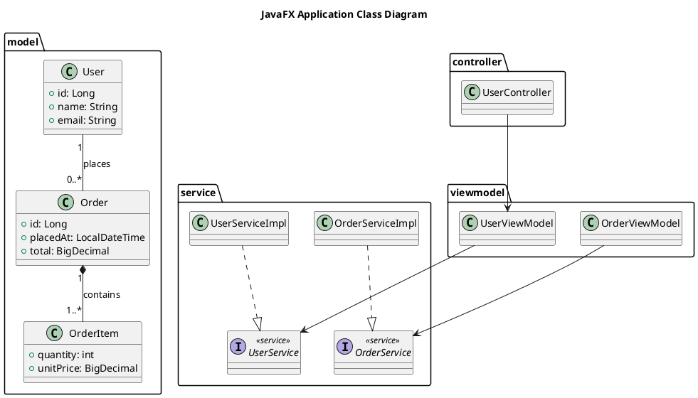
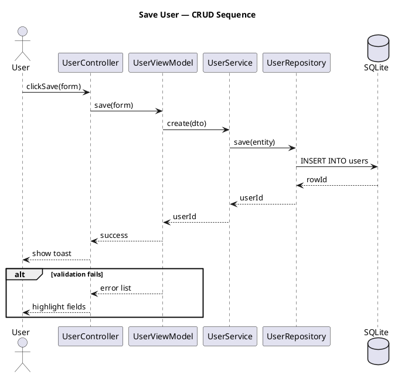
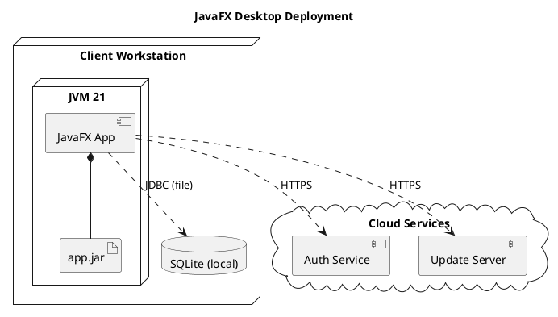

# UML Diagram Generation with PlantUML

This reference defines how the JavaFX Architect skill produces UML diagrams using PlantUML syntax. It covers class, sequence, and deployment diagrams, naming conventions, ADR cross-referencing, and a validation checklist. All diagrams are emitted as `.puml` files under `docs/diagrams/`.

## PlantUML Syntax Reference

Every diagram file starts with `@startuml` and ends with `@enduml`. Use the `title` directive for document identification.

### Class Declarations and Visibility

| Keyword | Meaning |
|---------|---------|
| `class C` | Concrete class |
| `abstract class C` | Abstract class (cannot be instantiated) |
| `interface I` | Pure contract |
| `enum E` | Enumeration of constants |

Visibility prefixes precede each member:

| Symbol | Visibility |
|--------|-----------|
| `+` | public |
| `-` | private |
| `#` | protected |
| `~` | package-private |

```plantuml
abstract class Account {
  +id: Long
  -balance: BigDecimal
  #open: boolean
  +deposit(amount: BigDecimal): void
  {abstract} close(): void
}
```

### Relationships

| Syntax | Relationship | Meaning |
|--------|--------------|---------|
| `A -- B` | Association | A knows B (undirected) |
| `A --> B` | Directed association | A uses/holds B |
| `A ..> B` | Dependency | A depends on B (transient) |
| `A ..|> B` | Realization | A implements interface B |
| `A --|> B` | Inheritance | A extends B |
| `A *-- B` | Composition | B is part of A (strong ownership) |
| `A o-- B` | Aggregation | B is part of A (weak ownership) |

### Multiplicity

Annotate relationship ends with cardinality to make ownership explicit.

| Notation | Cardinality |
|----------|-------------|
| `1` | Exactly one |
| `0..1` | Zero or one |
| `*` | Zero or more |
| `1..*` | One or more |

```plantuml
User "1" -- "0..*" Order : places
Order "1" *-- "1..*" OrderItem : contains
```

### Package and Namespace Grouping

Group classes by layer or feature using `package` blocks. Packages render as nested rectangles and keep large diagrams readable.

```plantuml
package "com.example.app.model" {
  class User
  class Order
}
package "com.example.app.service" {
  class UserService
}
```

### Notes and Annotations

Attach notes to clarify design intent or link to decisions. Supported positions: `note left`, `note right`, `note top`, `note bottom`.

```plantuml
class OrderService
note right of OrderService
  See ADR-0007 for transaction
  boundary decisions.
end note
```

### Stereotypes

Guillemet-quoted stereotypes mark the role of an element beyond its declared type.

| Stereotype | Applies To |
|------------|-----------|
| `<<interface>>` | Interface |
| `<<abstract>>` | Abstract class |
| `<<enumeration>>` | Enum |
| `<<service>>` | Application service |
| `<<repository>>` | Data access component |

```plantuml
interface UserRepository <<repository>>
```

## Class Diagram Best Practices

- Show only relevant classes: domain entities, key services, and interfaces. Omit every DTO, mapper, and utility.
- Group by package or layer using `package` blocks so the diagram mirrors the source tree.
- Use directed arrows (`-->`) to show dependency flow, and always add multiplicity on composition/aggregation ends.
- Keep member detail to public API only; private fields clutter the diagram without adding structural insight.



### Common Mistakes

- Including too many classes until the diagram becomes a wall of boxes.
- Missing relationships between services and their interfaces.
- Inconsistent naming: mixing `UserServiceImpl` with `userServiceImpl` or missing package qualifiers.

## Sequence Diagram Best Practices

- Use short aliases (`participant U as User`) to keep message lines short and readable.
- Prefer synchronous `->` for blocking calls and `-->` for return values; reserve `->` without a return only for fire-and-forget.
- Use `alt/else`, `opt`, `loop`, and `par` blocks to model branching and concurrency explicitly.
- Add `==` dividers to separate phases and `ref` to reuse shared interaction fragments.



### Common Mistakes

- Too many participants making the diagram wider than the page.
- Missing return arrows (`<--`) for synchronous calls, leaving the flow ambiguous.
- Deeply nested `alt` blocks that hide the happy path; keep nesting to two levels.

## Deployment Diagram Best Practices

- Model physical and logical runtime nodes: `node`, `cloud`, `database`, `component`, `artifact`.
- Label every connection with the protocol it carries (HTTPS, JDBC, file system).
- For JavaFX desktop apps, show the JVM process, the local database, and any cloud services the app reaches.



## Naming Conventions

| Rule | Pattern | Example |
|------|---------|---------|
| File naming | `{type}-diagram.puml` | `class-diagram.puml` |
| Class in package | fully qualified in `package` block | `com.example.app.model.User` |
| Class inside block | simple name | `User` |
| Document title | `title` directive | `title User Module Class Diagram` |

### ADR Cross-Referencing

Add a `note` linking diagram elements to the relevant Architecture Decision Record so design rationale is traceable.

```plantuml
class OrderService
note right of OrderService
  Transaction boundary defined in
  docs/adr/0007-transaction-scope.md
end note
```

## Validation Checklist

- [ ] All `.puml` files start with `@startuml` and end with `@enduml`.
- [ ] Every diagram has a `title` directive.
- [ ] All classes belong to a `package` block.
- [ ] All relationships have direction and multiplicity where applicable.
- [ ] Sequence diagrams include return arrows (`-->`) for synchronous calls.
- [ ] Deployment diagrams label all connections with a protocol.
- [ ] No syntax errors — verify with `plantuml -checkonly diagram.puml`.
- [ ] ADR-linked notes reference an existing file under `docs/adr/`.
