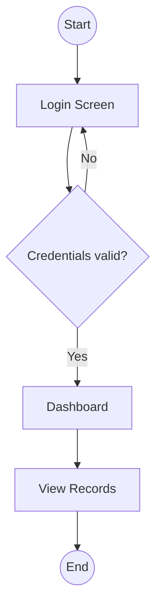
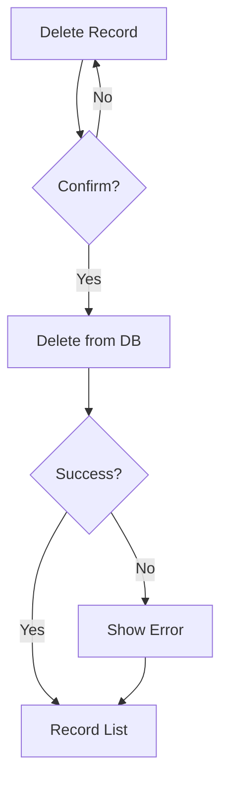
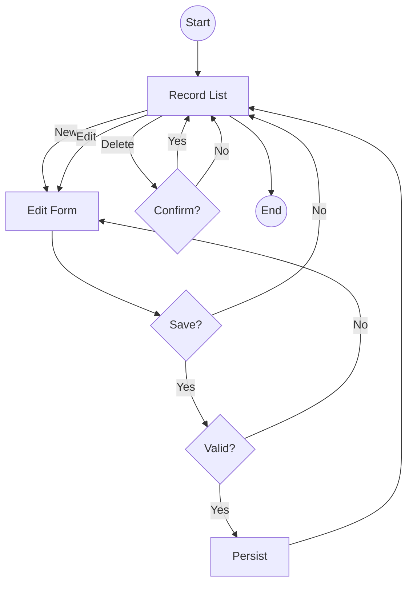
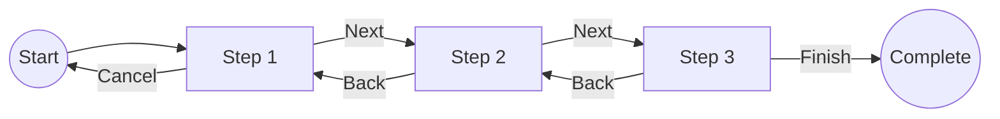
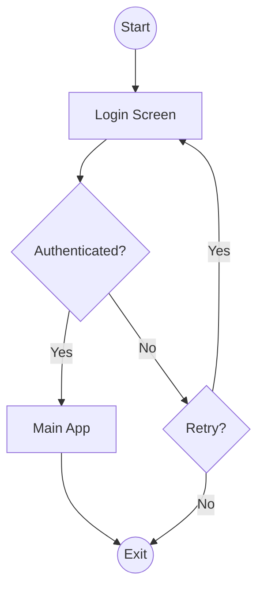
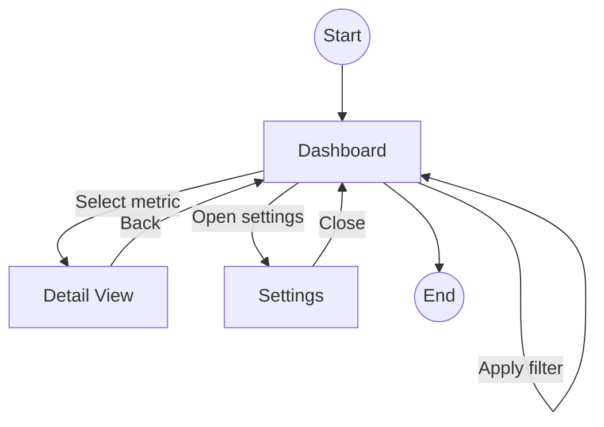

# Interaction Flow Diagram Generation

This document defines how to produce Mermaid interaction flow diagrams from natural language requirements. It covers Mermaid syntax, user journey extraction, navigation pattern selection, screen transition identification, decision point modeling, example diagrams, and validation rules.

## Mermaid Flowchart Syntax Guide

Interaction flows are written in Mermaid flowchart syntax and saved to `design/flow/interaction-flow.mmd`.

### Direction
- `graph TD` — top-down layout (default, best for most flows).
- `graph LR` — left-right layout (best for linear wizards and login steps).

### Node Shapes
| Syntax | Shape | Use For |
|--------|-------|---------|
| `A[Text]` | Rectangle | Screens / states |
| `A(Text)` | Rounded | Actions / user events |
| `A{Text}` | Diamond | Decisions |
| `A((Text))` | Circle | Start / end points |
| `A>Text]` | Flag | Notes / annotations |

### Edge Syntax
| Syntax | Meaning |
|--------|---------|
| `A --> B` | Transition from A to B |
| `A -- "label" --> B` | Labeled transition (e.g. Yes/No) |
| `A -->|label| B` | Alternate label syntax |
| `A -.-> B` | Dotted (asynchronous / optional) |

### Example

## User Journey Mapping

Extract flows from natural language descriptions using this procedure.

1. **Identify actors**: Who is using the app? (admin, guest, operator).
2. **List verbs**: Scan the description for action verbs — *open, view, edit, save, delete, export*.
3. **Convert verbs to states**: Each action implies a before-screen and an after-screen.
4. **Sequence the steps**: Order steps chronologically as the user would experience them.
5. **Detect branches**: Any sentence with "if", "when", "on failure", "otherwise" signals a decision node.
6. **Mark loops**: Steps that repeat (e.g., "retry login") become back-edges.
7. **Record entry and exit**: The first reachable screen is the entry; logout / close is the exit.

Example description: "The user logs in, sees the dashboard, can edit a record, and on save either returns to the dashboard or stays on the form if validation fails."

Extracted: `Login → Dashboard → Edit Form → {Save valid?} → Dashboard (yes) / Edit Form (no)`.

## Navigation Pattern Selection

Choose a navigation structure based on the number of screens and how users move between them.

| Pattern | When to Use | JavaFX Implementation |
|---------|-------------|----------------------|
| Menu bar | Many top-level screens, desktop convention | `MenuBar` with `Menu` / `MenuItem` |
| Tab pane | A few peer screens of equal weight | `TabPane` with `Tab` items |
| Breadcrumb | Hierarchical drill-down (folder/category) | `HBox` of `Button`/`Label` |
| Wizard steps | Strict sequential flow | `StackPane` + step indicators |
| Drawer navigation | Compact layouts, collapsible nav | `DrawerPane` or animated `VBox` |

## Screen Transition Identification

For every flow, explicitly mark four transition classes so nothing is missed.

| Class | Meaning | Diagram Marker |
|-------|---------|----------------|
| Entry point | First screen the user reaches | `((Start))` node |
| Exit point | Terminal screen (logout, close, finish) | `((End))` node |
| Loop | A transition that returns to an earlier screen | Back-edge `A --> A` or `C --> A` |
| Error path | Transition triggered by failure | Edge labeled `No` / `Error` |

## Decision Point Modeling

Decisions model yes/no branches, error handling, and confirmations.

- **Yes/No branch**: Use a diamond `{Question?}` with two outgoing edges labeled `Yes` and `No`.
- **Error handling**: Use a diamond `{Operation succeeded?}`; the `No` edge leads to an error screen or back to the source.
- **Confirmation dialog**: Use a diamond `{Confirm?}` before a destructive action; `Yes` proceeds, `No` returns to the prior screen.
- **Every decision must have both branches**: A diamond with only one outgoing edge is invalid.

## Example Diagrams for Common App Types

### CRUD Application

### Wizard

### Login Flow

### Dashboard

## Diagram Validation

Before emitting `interaction-flow.mmd`, verify the following rules.

| # | Rule | How to Verify |
|---|------|---------------|
| 1 | All screens reachable | Every node has at least one incoming edge (except Start) |
| 2 | No dead ends | Every non-terminal node has at least one outgoing edge |
| 3 | Decisions have both branches | Every diamond `{}` has at least two labeled outgoing edges |
| 4 | Single entry point | Exactly one `((Start))` node exists |
| 5 | Exit points defined | Terminal states lead to `((End))` or are explicitly terminal |
| 6 | Loops are intentional | Back-edges correspond to retry / back / cancel actions |
| 7 | Error paths covered | Operations that can fail have a `No` / `Error` branch |
| 8 | Mermaid syntax valid | Diagram renders without parse errors |
| 9 | Consistent node naming | Screen nodes match FXML file names (`main-view`, `login-view`) |
| 10 | Edge labels present on decisions | Yes/No or descriptive labels on all diamond edges |

A flow that fails any rule must be revised until all screens are reachable, no dead ends exist, and every decision branches completely.
