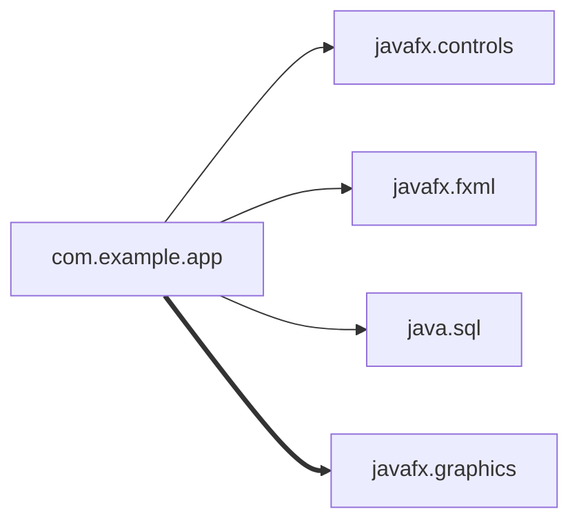
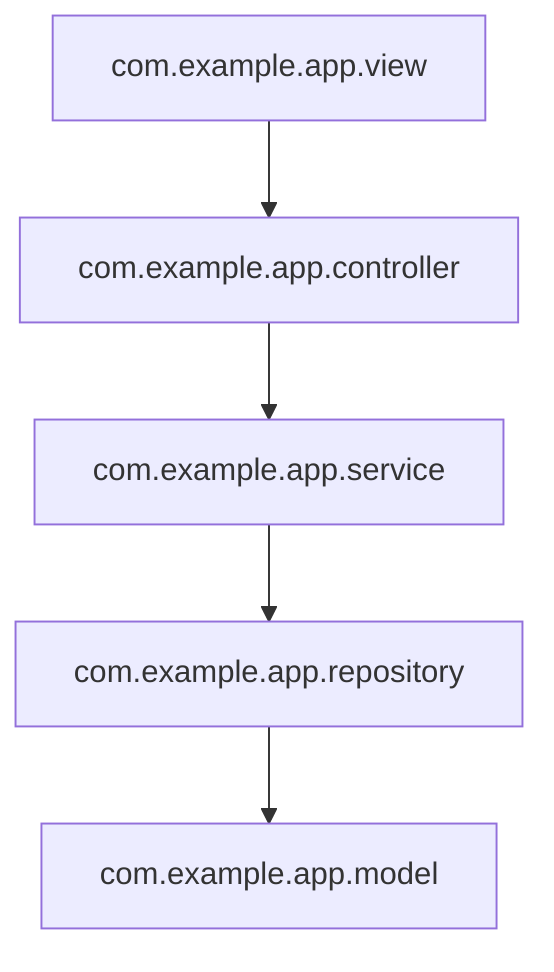

# Module Analysis, Package Structure Analysis, and Diagram Generation

This reference defines how the JavaFX DocGen skill analyzes the modular and package structure of a JavaFX project and renders it into an architecture document with Mermaid diagrams. It covers `module-info.java` parsing, package-layer identification, dependency extraction, pattern detection, and diagram generation.

## Overview

The architecture document captures the static structure of the system: which JPMS modules are involved, how packages depend on each other, which architectural pattern is in use, and which third-party dependencies the build pulls in. The output is a single Markdown file containing prose, tables, and embedded Mermaid diagrams.

## Parsing module-info.java

When a `module-info.java` file exists at `src/main/java/module-info.java`, the generator parses its directives. Each directive maps to a section of the architecture document.

```java
module com.example.app {
    requires javafx.controls;
    requires javafx.fxml;
    requires java.sql;
    requires transitive javafx.graphics;
    exports com.example.app;
    exports com.example.app.model;
    opens com.example.app.controller to javafx.fxml;
    uses com.example.app.spi.DataProvider;
    provides com.example.app.spi.DataProvider
        with com.example.app.sql.SqlDataProvider;
}
```

Directive extraction rules:

| Directive | Meaning | Documented As |
|-----------|---------|---------------|
| `requires X` | Read dependency on module X | Required module |
| `requires transitive X` | Dependency leaked to consumers | Transitive requirement |
| `exports P` | Package P is public API | Exported package |
| `opens P to M` | Reflective access for M | Opened package (reflection) |
| `uses S` | Service consumed via ServiceLoader | Service usage |
| `provides S with Impl` | Service implementation offered | Service provision |

## Analyzing Package Structure

The generator scans `src/main/java/` and builds a package tree. For each package it records the class count and the set of packages it imports (resolved within the project). This import graph drives the dependency diagram and the layer classification.

### Identifying Architectural Layers

Packages are classified into layers by name suffix or keyword. The default mapping:

| Package Suffix / Keyword | Layer |
|--------------------------|-------|
| `model`, `entity`, `domain` | Model |
| `view`, `ui`, `fxml` | View |
| `controller` | Controller |
| `viewmodel`, `vm` | ViewModel |
| `presenter` | Presenter |
| `service` | Service |
| `repository`, `dao` | Repository |
| `util`, `common` | Utility |
| `config` | Configuration |

Packages that match no keyword are listed under *Other*.

## Identifying the Architecture Pattern

The pattern is inferred from which layers are present:

| Detected Layers | Pattern | Rationale |
|-----------------|---------|-----------|
| View + Controller + Model | MVC | Classic triad |
| View + ViewModel + Model | MVVM | Binding-based separation |
| View + Presenter + Model | MVP | Passive view + presenter |
| Service + Repository + Model | Layered | N-tier backend style |
| View + Controller | MVC (lite) | No domain model yet |

When multiple patterns are plausible, the generator selects the one with the most layer matches and notes the ambiguity in the document.

## Generating Mermaid Module Diagrams

The JPMS module graph is rendered as a Mermaid `graph LR` diagram. Each `requires` directive becomes an arrow from the project module to the dependency; `requires transitive` uses a bold arrow.



## Generating Package Dependency Graphs

The internal package dependency graph is rendered as a Mermaid `graph TD` diagram. An arrow `A --> B` means package A imports at least one class from package B. Self-imports are omitted, and utility packages that everyone imports may be collapsed to reduce clutter.



## Extracting Dependencies from pom.xml

The generator reads `pom.xml` (and any active `<profile>` blocks) to list every declared dependency. For each dependency it records `groupId`, `artifactId`, `version`, and `scope`.

```xml
<dependency>
    <groupId>org.openjfx</groupId>
    <artifactId>javafx-controls</artifactId>
    <version>21.0.2</version>
</dependency>
<dependency>
    <groupId>org.xerial</groupId>
    <artifactId>sqlite-jdbc</artifactId>
    <version>3.45.1.0</version>
    <scope>runtime</scope>
</dependency>
```

Rendered dependency table:

```markdown
### Dependencies

| GroupId | ArtifactId | Version | Scope |
|---------|-----------|---------|-------|
| org.openjfx | javafx-controls | 21.0.2 | compile |
| org.openjfx | javafx-fxml | 21.0.2 | compile |
| org.xerial | sqlite-jdbc | 3.45.1.0 | runtime |
| org.junit.jupiter | junit-jupiter | 5.10.2 | test |
```

Dependencies are grouped by scope (`compile`, `runtime`, `test`, `provided`) and JavaFX modules are highlighted separately.

## Build Plugin Summary

Plugins declared under `<build><plugins>` are summarized to show how the project is assembled.

```markdown
### Build Plugins

| Plugin | Purpose |
|--------|---------|
| javafx-maven-plugin | Runs the app via `mvn javafx:run` |
| maven-compiler-plugin | Compiles sources with the configured JDK |
| jacoco-maven-plugin | Generates code-coverage reports |
| jpackage (via badge) | Produces native installers |
```

## Architecture Document Template

The final document follows this structure:

```markdown
# Architecture

## System Overview
<one-paragraph description>

## Architecture Pattern
<pattern> — <rationale>

## Module Diagram
<Mermaid module graph>

## Package Dependency Graph
<Mermaid package graph>

## Package Structure
<table of packages with class counts and layers>

## Dependencies
<dependency table>

## Build Configuration
<plugin summary>
```

Diagrams are embedded as fenced `mermaid` code blocks so they render in GitHub, GitLab, and most Markdown previewers.
