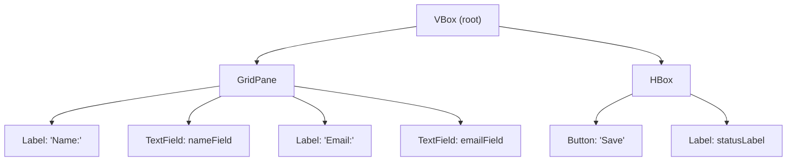

# Visual Preview — UI Screenshot Capture

This document defines the methods for capturing UI screenshots during runtime verification, enabling visual preview of JavaFX applications within the closed-loop cycle.

## Capture Methods by JavaFX Version

### Method 1: JavaFX 26+ Headless Preview API (Preferred)

JavaFX 26 introduces a Headless Preview API that can capture UI screenshots without a display, ideal for CI environments.

**Requirements**: JavaFX 26+, JDK 24+

**Implementation**:

```java
import javafx.application.Platform;
import javafx.embed.swing.SwingFXUtils;
import javafx.scene.Scene;
import javafx.scene.image.WritableImage;
import javax.imageio.ImageIO;
import java.io.File;

// After stage.show() completes:
Platform.runLater(() -> {
    Scene scene = stage.getScene();
    WritableImage screenshot = scene.snapshot(null);
    try {
        ImageIO.write(SwingFXUtils.fromFXImage(screenshot, null), "png",
            new File("target/ui-preview.png"));
    } catch (Exception e) {
        e.printStackTrace();
    }
});
```

**Headless mode** (JavaFX 26+):

```bash
mvn javafx:run -Djavafx.headlessPreview=true -Dprism.order=sw
```

### Method 2: Monocle + Robot API (JavaFX 17+)

For JavaFX versions without the Headless Preview API, use Monocle test framework with `javafx.scene.robot.Robot` to capture screenshots.

**Requirements**: Monocle dependency, JavaFX 17+

**Maven dependency**:

```xml
<dependency>
    <groupId>org.openjfx</groupId>
    <artifactId>javafx-monocle</artifactId>
    <version>${javafx.version}</version>
    <scope>test</scope>
</dependency>
```

**Implementation**:

```java
import com.sun.glass.ui.monocle.MonoclePlatform;
import javafx.scene.robot.Robot;
import javafx.scene.image.WritableImage;
import javafx.embed.swing.SwingFXUtils;
import javax.imageio.ImageIO;

// Start with Monocle platform:
// mvn javafx:run -Dmonocle.platform=Headless -Dprism.order=sw

Robot robot = new Robot();
WritableImage screenshot = robot.getScreenCapture(null,
    (int) scene.getWidth(), (int) scene.getHeight());
ImageIO.write(SwingFXUtils.fromFXImage(screenshot, null), "png",
    new File("target/ui-preview.png"));
```

### Method 3: AWT Robot (Display Environment Only)

When a display is available (local desktop, not CI), use AWT `Robot` to capture the window.

**Requirements**: Display environment (not headless)

**Implementation**:

```java
import java.awt.Robot;
import java.awt.Rectangle;
import java.awt.image.BufferedImage;
import javax.imageio.ImageIO;

// After stage.show() and a brief wait for rendering:
Robot awtRobot = new Robot();
Rectangle bounds = new Rectangle(
    (int) stage.getX(), (int) stage.getY(),
    (int) stage.getWidth(), (int) stage.getHeight());
BufferedImage screenshot = awtRobot.createScreenCapture(bounds);
ImageIO.write(screenshot, "png", new File("target/ui-preview.png"));
```

### Method 4: FXML Control Tree Diagram (Fallback)

When no screenshot can be captured (headless without Monocle, or capture fails), generate an FXML control tree diagram using Mermaid syntax as a structural preview.

**Output**: A Mermaid flowchart representing the FXML node hierarchy.



## Capture Workflow

1. **Detect JavaFX version**: Parse `pom.xml` or `build.gradle` for the JavaFX version
2. **Detect environment**: Check for display (`DISPLAY` env var / Windows desktop session)
3. **Select method**:
   - JavaFX 26+ → Method 1 (Headless Preview API)
   - JavaFX 17-25 + no display → Method 2 (Monocle + Robot)
   - JavaFX 17-25 + display → Method 3 (AWT Robot)
   - All methods fail → Method 4 (FXML control tree diagram)
4. **Capture**: Execute the selected method after `stage.show()` completes
5. **Save**: Write screenshot to `target/ui-preview.png`
6. **Embed**: Reference the screenshot in the verification report

## Screenshot Quality Checks

| Check | Criteria | Severity if Failed |
|-------|----------|-------------------|
| Screenshot file exists | `target/ui-preview.png` is generated | Info (non-blocking) |
| File size > 0 | Screenshot is not empty (size > 1KB) | Info |
| Image dimensions reasonable | Width >= 200px and Height >= 150px | Info |
| No exception during capture | Capture completed without throwing | Minor (if capture fails, fall back to Method 4) |

> **Note**: Screenshot capture failures are non-blocking — they do not affect the quality gate. The screenshot is an enhancement for visual confirmation, not a pass/fail criterion.

## Report Integration

The captured screenshot is embedded in the verification report under a **UI Preview** section:

```markdown
## UI Preview


> Captured using: [Method name]
> Resolution: [width]x[height]
> Capture time: [timestamp]
```

If no screenshot is available, the section shows the FXML control tree diagram instead:

```markdown
## UI Preview

> Screenshot capture unavailable. Showing FXML control tree as structural preview.

[Mermaid flowchart of FXML node hierarchy]
```
